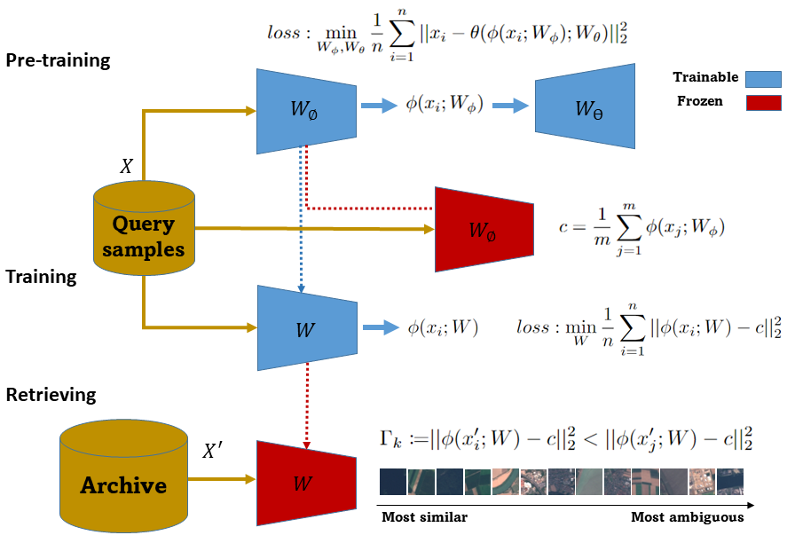

# Remote Sensing Image Retrieval Using Enhanced Deep SVDD

Official implementation of paper [Query By Example in Remote Sensing Image Archive Using Enhanced Deep Support Vector Data Description](https://ieeexplore.ieee.org/abstract/document/10003647)



## Overview

This repository contains the implementation of an enhanced Deep Support Vector Data Description (SVDD) approach for remote sensing image retrieval. The method improves upon traditional query-by-example techniques by incorporating advanced deep learning architectures and optimization strategies.

## Features

- Enhanced Deep SVDD implementation for remote sensing image retrieval
- Split Transform Network architecture
- Gabor Convolutional Attention ResNet
- TCAL (Triple Criteria Active Learning) framework
- Comprehensive evaluation metrics
- Visualization tools including t-SNE and histogram analysis

## Installation

1. Clone the repository:

```bash
git clone https://github.com/omid-ghozatlou/Query-by-Example-Using-SVDD.git
cd Query-by-Example-Using-SVDD
```

2. Install the required dependencies:

```bash
pip install -r requirements.txt
```

## Project Structure

```
├── base/               # Base classes and utilities
├── datasets/          # Dataset handling and preprocessing
├── networks/          # Neural network architectures
├── optim/            # Optimization algorithms
├── utils/            # Utility functions
├── deepSVDD.py       # Main Deep SVDD implementation
├── TCAL.py           # Transfer Learning implementation
├── Gabor_CA_ResNet.py # Gabor Convolutional Attention ResNet
└── Split_Transform_Network.py # Split Transform Network
```

## Usage baseline TCAL

[](https://colab.research.google.com/drive/1O1rVIDR6gsheBJq3s4M-D_stOiWYGSvb?usp=sharing)

### Basic Usage

```python
from deepSVDD import DeepSVDD
from networks import SplitTransformNetwork

# Initialize the model
model = DeepSVDD(network=SplitTransformNetwork())

# Train the model
model.train(train_data)

# Perform retrieval
results = model.retrieve(query_image)
```

## Requirements

- Python 3.7+
- PyTorch
- NumPy
- scikit-learn
- Matplotlib

## Citation

If you use this code in your research, please cite our paper:

```bibtex
@ARTICLE{10003647,
  author={Ghozatlou, Omid and Conde, Miguel Heredia and Datcu, Mihai},
  journal={IEEE Journal of Selected Topics in Applied Earth Observations and Remote Sensing}, 
  title={Query by Example in Remote Sensing Image Archive Using Enhanced Deep Support Vector Data Description}, 
  year={2023},
  volume={16},
  number={},
  pages={1197-1210},
  keywords={Image retrieval;Feature extraction;Training;Earth;Deep learning;Data models;Big Data;Deep neural network (DNN);deep support vector data description (SVDD);EuroSAT;one-class classification;query by example in earth observation;remote sensing (RS) image retrieval},
  doi={10.1109/JSTARS.2022.3233105}}
```

## License

This project is licensed under the MIT License - see the [LICENSE](LICENSE) file for details.

## Acknowledgements

- [Kernel K-means](https://gist.github.com/mblondel/6230787)
- The authors would like to thank all contributors and users of this repository.
